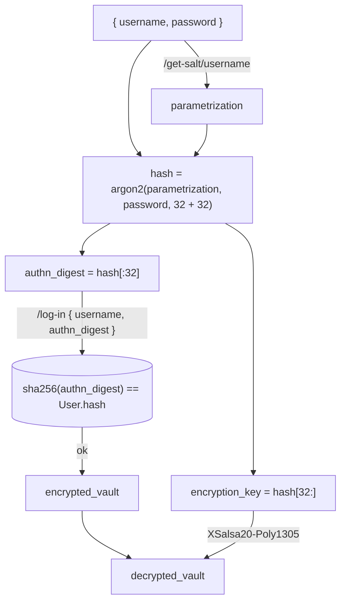
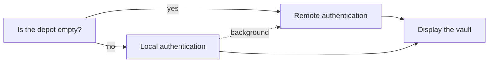

# Architecture

These notes are mostly concerned with security aspects.

## Authentication

The graph below demonstrates the remote authentication procedure.

Argon2 parameters are generated on the client in [argon2.ts](/pwa/src/cryptography/argon2.ts) during registration. The recommended parameters can be changed if necessary &mdash; that will cause automated rehashes next time users log in.

If 2FA is enabled, `/log-in` does not immediately return the encrypted vault; it should be followed by `/provide-otp`, which accepts both time-based and 128-bit recovery codes and only then returns the encrypted vault.

### Offline mode

Offline mode is based on `localStorage`. Once it's activated, separate Argon2 parameters are generated; `username`, local `authn_digest` and the vault encrypted by the local `encryption_key` are stored in `localStorage` ('the depot'). Note that `authn_digest` is not put through `sha256` here.

Once local (depot-based) authentication succeeds, the remote authentication procedure is attempted automatically in the background to pick up latest updates and enable editing. If 2FA is enabled, a 128-bit temporary token is provided to `/provide-otp`. This token is initially obtained by specifying `yield_trusted_token` in `ProvideOtpRequest`; it's then encrypted with the local `encryption_key` and stored in the depot. All subsequent background requests to `/provide-otp` renew the token by specifying `yield_trusted_token` again.

## Changing the master key

* Generates new Argon2 parameters (both remotely and locally).
* Re-encrypts the vault (both remotely and locally).
* Additionally disables all other sessions.

## Encryption-at-rest

From ['Storage on DigitalOcean'](https://digitalocean.github.io/navigators-guide/book/03-backup/ch07-storage-on-digitalocean.html#block-storage-volumes):

> '...are encrypted at rest with AES-256 bit LUKS encryption within the storage cluster.'

## Managing versions

Client and server binaries contain the information about the earliest version still permitted to run built in.

* Newer service workers forcefully **reload** the pages with obsolete versions.
  * In general service workers attempt to load `index.html` from network if they can within the allowed time window.
  * It's important to remember about the Cloudflare cache, which may need to be invalidated in certain deployment scenarios.
* Servers **reject** requests where the app version is obsolete (with `UNIMPLEMENTED`, 501).
